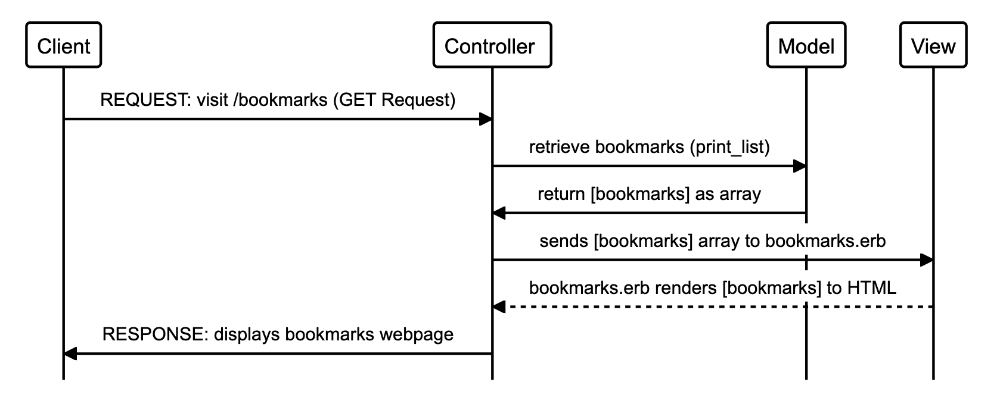

## Bookmark Manager

### User Story 1
```
As a web user 
So that I can access websites I regularly visit
I'd like to see list of saved bookmarks
```

#### Domain Model


| Nouns   | Verbs     |
|---------|-----------|
|Bookmarks| Show list |
|List     |           |


| Nouns   | Property/ Owner|
|---------|-----------     |
|Bookmarks| Owner          |
|List     | Owner          |


| Actions  | Owned by?  |
|--------- |----------- |
|print_list| List       |


| Actions  |Property it reads or changes |
|--------- |-----------                  |
|print_list| @bookmark_list              |


|Class     | Bookmark    |
|--------- | ----------- |
|Properties| @url, @title|
|Actions   | initialize  |


Class     | List| 
---------|----------|
 Properties |  @bookmark_list | 
 Actions | print_list | 


#### Diagram planning: 
* REQUEST: client visits /bookmarks (get request) (client --> controller/server)
* controller (app.rb) asks Bookmark class (model) to retrieve bookmarks (#print_list) (server --> model)
* the Bookmark class returns all stored bookmarks as array (model --> controller/server)
* controller renders the [bookmarks] array to webpage (HTML) view (controller --> view --> controller)
* RESPONSE: This view is sent to the user as a response (controller --> client)

#### User Story 1 Features: 
  1. a Controller
  2. a Bookmark class
  3. a bookmark view
  
  

## How to use
### To set up the project
Clone this repository and then run:
```
 bundle
 ```

 ### To set up the database

 Connect to `psql` and create the `bookmark_manager` database:

 ```
 CREATE DATABASE bookmark_manager;
 ```

 To set up the appropriate tables, connect to the database in `psql` and run the SQL scripts in the `db/migrations` folder in the given order.

 ### To run the Bookmark Manager app:

 ```
 rackup -p 9292
 ```

 To view bookmarks, navigate to `localhost:9292/bookmarks`

 ### To run tests:

```
rspec
```
### To run linting:
```
rubocop
```
